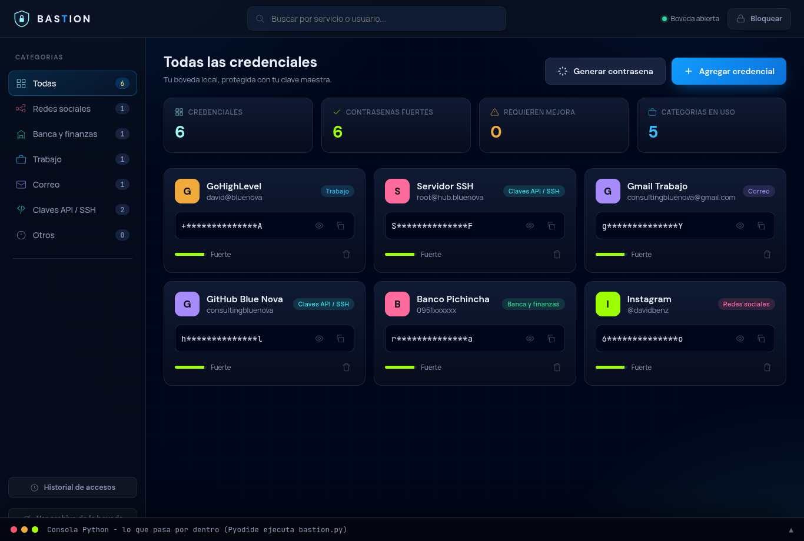
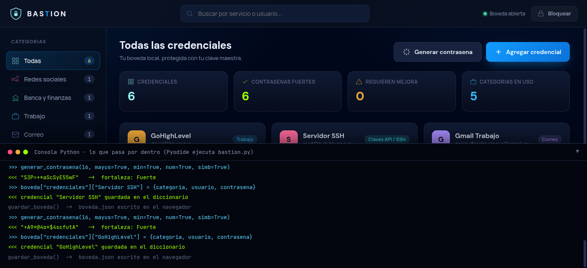

# BASTION - Boveda Personal de Credenciales

Gestor personal de credenciales con generador de contrasenas seguras.
**Proyecto Integrador - Logica de Programacion - UIDE.**


> Tema del proyecto integrador: **El impacto de las nuevas tecnologias en la
> sociedad: desarrollo y proyeccion de soluciones informaticas.**

---

## Demo en vivo

### **https://bluenovasas.github.io/bastion-uide/webapp/**

La aplicacion funciona en el navegador, sin instalar nada. El codigo real de
`bastion.py` se ejecuta dentro del navegador mediante Pyodide (Python sobre
WebAssembly), y un panel "Consola Python" muestra en vivo lo que ocurre por
dentro. La boveda se guarda en el almacenamiento local del navegador.



El panel "Consola Python" muestra en vivo cada llamada al codigo real de `bastion.py`:



## Stack tecnologico

| Componente | Tecnologia |
|------------|------------|
| Logica del sistema | **Python 3** (biblioteca estandar) |
| Interfaz web | **HTML5**, **CSS3**, **JavaScript** |
| Python en el navegador | **Pyodide** (Python compilado a WebAssembly) |
| Diagrama de flujo | RAPTOR |
| Documento | PDF (formato APA 7) |
| Presentacion | PowerPoint |
| Control de versiones | **Git** + **GitHub** (commits firmados con GPG) |
| Publicacion | GitHub Pages |

## Datos del proyecto

| Campo | Valor |
|-------|-------|
| Proyecto | BASTION - Boveda Personal de Credenciales |
| Integrante | David Alexander Benz Zambrano (individual) |
| Organizacion | Blue Nova SAS |
| Cedula | 1726678673 |
| Correo institucional | dabezza@uide.edu.ec |
| Materia | Logica de Programacion |
| Docente | Msc. Lilian Aman |
| Carrera | Ingenieria en Ciberseguridad |
| Universidad | Universidad Internacional del Ecuador (UIDE) |
| Paralelo | 1-CIB-1A |
| Fecha | 28 de junio de 2026 |

## Que es BASTION

BASTION resuelve un problema cotidiano: una persona administra decenas de
credenciales y, sin herramientas, cae en practicas inseguras (reutilizar claves,
usar contrasenas debiles, guardarlas sin cifrar). BASTION genera contrasenas
seguras, las organiza por categorias y las protege detras de una unica contrasena
maestra cuyo hash se almacena con SHA-256, sin depender de la nube.

## Arquitectura en tres capas

El sistema separa responsabilidades en tres capas, tanto en la version de consola
como en la web:

1. **Presentacion**: la interfaz (menus de consola en `bastion.py`, o la interfaz
   web en `webapp/`).
2. **Logica de negocio**: el generador de contrasenas, las validaciones, el
   calculo de fortaleza y la busqueda. En la web, esta capa es el mismo
   `bastion.py` ejecutado con Pyodide.
3. **Persistencia**: el archivo JSON local (consola) o el almacenamiento del
   navegador (web).

## La aplicacion web: como usarla

Abrir **https://bluenovasas.github.io/bastion-uide/webapp/** en un navegador
moderno (con conexion a internet la primera vez, para cargar el motor de Python).

1. **Espera la carga**: aparece "Iniciando el motor de Python" durante unos
   segundos mientras se descarga Pyodide.
2. **Primera vez - crear boveda**: define una contrasena maestra (minimo 8
   caracteres) y confirmala. Esa clave protege toda la boveda.
3. **Siguientes veces - iniciar sesion**: ingresa la contrasena maestra. Tras 3
   intentos fallidos la boveda se bloquea.
4. **Generar contrasena**: elige longitud y tipos de caracteres; el sistema crea
   una clave segura y muestra su fortaleza (Debil, Media o Fuerte).
5. **Agregar credencial**: registra un servicio con su categoria, usuario y
   contrasena (puede ser la generada).
6. **Buscar**: filtra las credenciales por nombre de servicio.
7. **Ver historial**: muestra los accesos registrados con fecha y hora.
8. **Consola Python**: el panel de la derecha muestra en vivo cada llamada a
   Python y su resultado, para evidenciar que la logica corre realmente en Python.
9. **Bloquear**: cierra la sesion; la boveda queda guardada en el navegador.

## La version de consola (CLI)

El mismo sistema funciona como programa de linea de comandos:

```
python3 bastion.py
```

No requiere dependencias externas: usa solo la biblioteca estandar de Python
(`hashlib`, `json`, `os`, `secrets`, `string`, `getpass`, `sys`, `datetime`).

## Estructuras de programacion (integracion de las 4 unidades)

| Unidad | Contenido | Donde se aplica |
|--------|-----------|-----------------|
| 1 | Analisis y diagramas | Casos de uso, flujo (Raptor) y arquitectura en tres capas |
| 2 | Entorno y tipos de datos | GitHub, variables `str`, `int`, `bool` |
| 3 | Bucles, decisiones, operadores | `while` con contador, `for` con `range()` y `.items()`, `if/elif/else`, contadores `+=` |
| 4 | Datos y funciones | Tupla `CATEGORIAS`, lista `historial`, funciones con parametros por defecto |

## Estructura del repositorio

```
bastion-uide/
├── bastion.py            Codigo fuente del sistema (Python)
├── webapp/               Aplicacion web funcional
│   ├── index.html        Interfaz (HTML)
│   ├── styles.css        Estilos, identidad Blue Nova (CSS)
│   ├── app.js            Logica e integracion con Pyodide (JavaScript)
│   ├── favicon.svg       Isotipo (escudo)
│   └── README.md
├── documento/            Documento del proyecto en PDF
├── presentacion/         Presentacion final (PowerPoint y PDF)
├── manuales/             Manual de Usuario, Manual Tecnico y Guion (MD y PDF)
├── guiones/              Guiones de los tres videos del entregable (MD y PDF)
├── diagramas/            Casos de uso, arquitectura y flujo (Raptor)
├── prototipo/            Prototipo de interfaz de alta fidelidad
├── autonomos/            Aprendizajes autonomos del periodo, en carpetas
├── videos/               Enlaces a los videos explicativos (Loom)
├── README.md
├── LICENSE
└── .gitignore
```

## Documento, presentacion y diagramas

| Entregable | Ubicacion |
|------------|-----------|
| Documento del proyecto (PDF) | [`documento/Proyecto_Integrador_BASTION.pdf`](documento/Proyecto_Integrador_BASTION.pdf) |
| Presentacion (PowerPoint y PDF) | [`presentacion/`](presentacion/) |
| Manual de Usuario y Manual Tecnico (PDF) | [`manuales/`](manuales/) |
| Guiones de los tres videos (PDF) | [`guiones/`](guiones/) |
| Diagramas (casos de uso, arquitectura, flujo) | [`diagramas/`](diagramas/) |
| Prototipo de interfaz | [`prototipo/`](prototipo/) |

## Videos del entregable

| Video | Contenido | Duracion | Enlace |
|-------|-----------|----------|--------|
| Video 0 | Explicacion general del repositorio y el prototipo | 2:13 min | https://www.loom.com/share/730d6ef14cd249f590bf2939a9e092c6 |
| Video 1 | Explicacion del diagrama de flujo en Raptor | 2:41 min | https://www.loom.com/share/6bcada5da58e4e4c9ea3d76b6f34dff9 |
| Video 2 | Demostracion del codigo Python en funcionamiento | 4:24 min | https://www.loom.com/share/a2bdcf658b0049ec8ab9f98a79a68b6f |

Los videos se alojan en Loom para no superar el limite de 100 MB por archivo de GitHub.

## Autoria y licencia

Desarrollado por **David Alexander Benz Zambrano** bajo **Blue Nova SAS**.
Licencia MIT (ver [LICENSE](LICENSE)). 2026.
