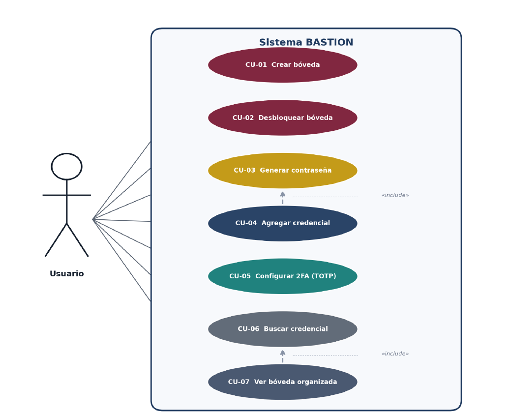
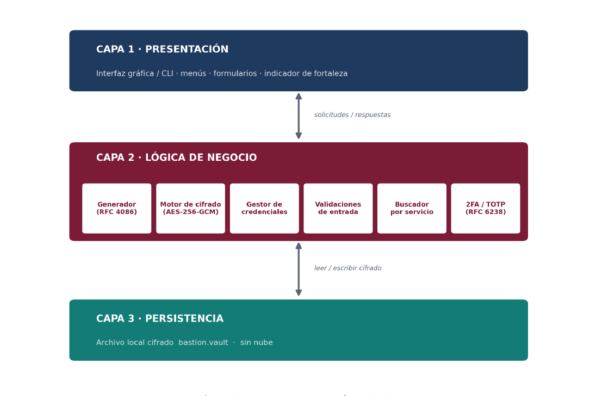
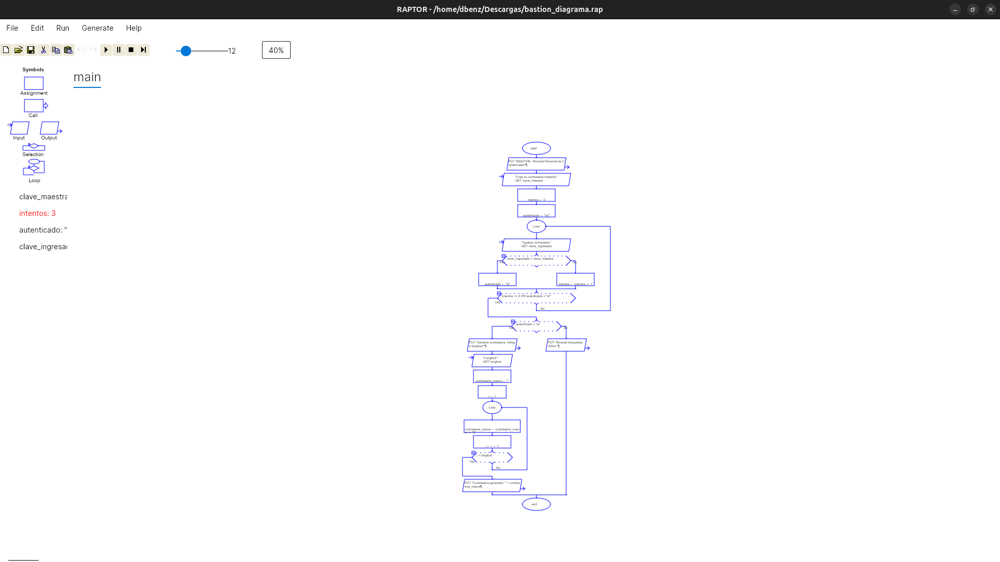

# Diagramas del proyecto

Diagramas de funcionalidad y de arquitectura de BASTION, elaborados durante el
diseno del sistema. Las imagenes se pueden ver directamente en GitHub; el archivo
de Raptor se abre con el programa RAPTOR.

## Diagrama de casos de uso (funcionalidad)

## Diagrama de arquitectura en tres capas

## Diagrama de flujo (Raptor)

Modela el proceso principal: apertura del programa, autenticacion con la
contrasena maestra mediante un bucle con contador de intentos, y generacion de
una contrasena caracter por caracter.

## Archivos

| Archivo | Contenido |
|---------|-----------|
| `casos_de_uso.png` | Diagrama de casos de uso del sistema (UML) |
| `arquitectura_capas.png` | Diagrama de arquitectura en tres capas |
| `bastion_diagrama.rap` | Diagrama de flujo editable (se abre con RAPTOR) |
| `imagen_diagrama_raptor.png` | Imagen del diagrama de flujo para vista rapida sin RAPTOR |
