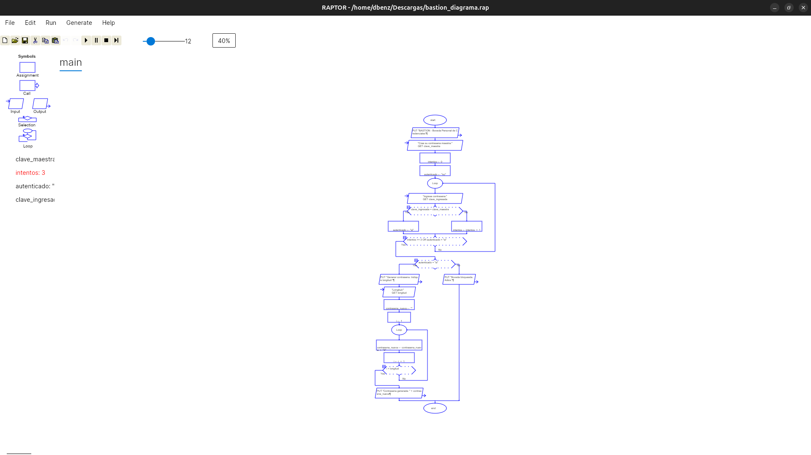

# Documentacion del diseno

## Diagrama de flujo en Raptor

Diagrama del proceso principal de BASTION elaborado en RAPTOR: apertura del
programa, autenticacion con la contrasena maestra mediante un bucle con contador
de intentos, y generacion de una contrasena caracter por caracter con un bucle.

### Imagen del diagrama de Raptor

## Archivos

| Archivo | Contenido |
|---------|-----------|
| `bastion_diagrama.rap` | Diagrama editable (se abre con el programa RAPTOR) |
| `imagen_diagrama_raptor.png` | Imagen del diagrama para vista rapida sin RAPTOR |
